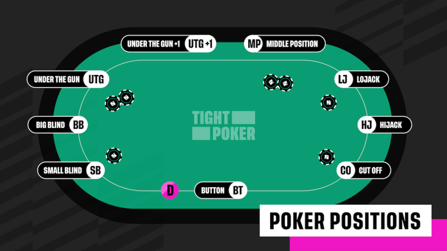

A python poker equity calculator which can input up to 9 hands of input from different positions at the table in the texas hold'em format. The program takes these hands at various positions and is given a poker phase of either preflop, flop, turn, or the river setting, where, based on what cards are present in the situation for each phase, the calculator will compute all the inputted hands' equity against each other and print the resulting head to head equity layout. For example, if the calculator was given 2 hands head to head with a flop of 3 miscellaneous cards, it would calculate which hand is currently ahead in a rounded percentage with the equity of the hand which is behind or current losing, being the chance that they can hit an out (card which makes their hand stronger) to be ahead of the currently winning hand. 

This program is not a poker range solver and the position does not matter or affect the calculations in this project, but for terminology sake, the output will be given like this "BB: x% CO: y% (printed in a new line)", meaning the big blind has x equity percentage and the player with the hand in the cutoff position has y equity percentage head to head within this hand. Here is a picture to familiarise yourself with the table positions:
